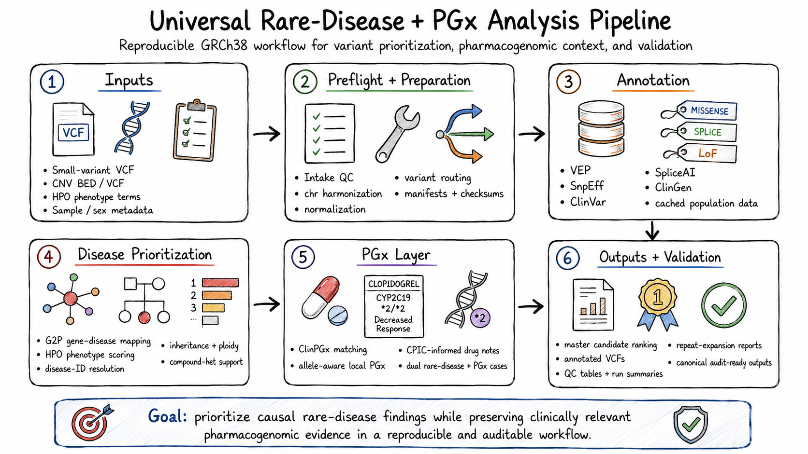

.. meta::
   :description: Documentation for a reproducible GRCh38 rare-disease and pharmacogenomics analysis pipeline.

.. raw:: html

   <h1 class="hero-title">Universal Rare-Disease + PGx Analysis Pipeline</h1>
   
Reproducible GRCh38 workflow for variant prioritisation, pharmacogenomic context, and validation

.. rst-class:: hero-image

Overview
========

|project_name| integrates variant preprocessing, functional annotation,
clinical databases, gene–disease relationships, HPO phenotype evidence,
inheritance modelling, copy-number analysis, repeat-expansion routing and
selected pharmacogenomic interpretation.

The workflow accepts prepared **GRCh38** case-level data and preserves original
inputs, branch-specific outputs, manifests, checksums and validation evidence.
It is intended for research, education and expert-supported candidate review,
not independent clinical diagnosis.

Features
========

.. raw:: html

   

     
<h3>Universal intake</h3>
Checks VCF structure, sample context, genome build, HPO data, sex and ploidy before analysis.

     
<h3>Variant-class routing</h3>
Separates SNVs/indels, DEL/DUP CNVs, repeat expansions and unsupported structural variants.

     
<h3>Integrated annotation</h3>
Combines VEP, SnpEff, ClinVar, SpliceAI, ClinGen, G2P, HPO and MONDO evidence.

     
<h3>Inheritance-aware ranking</h3>
Supports ploidy-aware inheritance and phased or possible compound-heterozygous evidence.

     
<h3>Allele-aware PGx</h3>
Requires exact chromosome, position, REF and ALT matching for local pharmacogenomic evidence.

     
<h3>Auditable outputs</h3>
Produces master tables, case summaries, logs, manifests, checksums and final audit evidence.

   

Validation status
=================

.. raw:: html

   
<strong>Project validation:</strong> Thirteen prepared synthetic VCFs passed structural preflight. Twelve cases were included in the final behavioural audit, and all twelve met their canonical candidate or routing expectations. Patient 13 was intentionally not run through the complete workflow.

Documentation
=============

Start with :doc:`getting_started` for the quickest route from a cloned repository
to a local documentation build. Continue with the installation, workflow and
validation chapters for the complete project procedure.

* :doc:`getting_started` — clone, prepare and build the documentation
* :doc:`installation` — operating system, containers, tools and resources
* :doc:`workflow` — complete analytical architecture and branch routing
* :doc:`inputs` — VCF, CNV, HPO and metadata requirements
* :doc:`outputs` — result directories, master tables and reproducibility files
* :doc:`validation` — structural preflight, regression tests and final audit
* :doc:`troubleshooting` — common failures and safe recovery
* :doc:`limitations` — scientific and clinical boundaries

Repository
==========

The source repository is hosted at:

* `Wahid-25/rare-disease-genomics-pipeline <https://github.com/Wahid-25/rare-disease-genomics-pipeline>`_

Large databases, built ``.sif`` images, complete case outputs and real patient
data remain local and are excluded from GitHub.

Clinical-use notice
===================

The pipeline provides computational prioritisation. It does not independently
confirm variants, establish a diagnosis, calculate definitive recurrence risk or
recommend medication changes. Important findings require qualified review and,
where appropriate, orthogonal confirmation.

Table of contents
=================

.. toctree::
   :maxdepth: 2
   :caption: Documentation

   getting_started
   installation
   workflow
   inputs
   outputs
   validation
   troubleshooting
   limitations
   references
